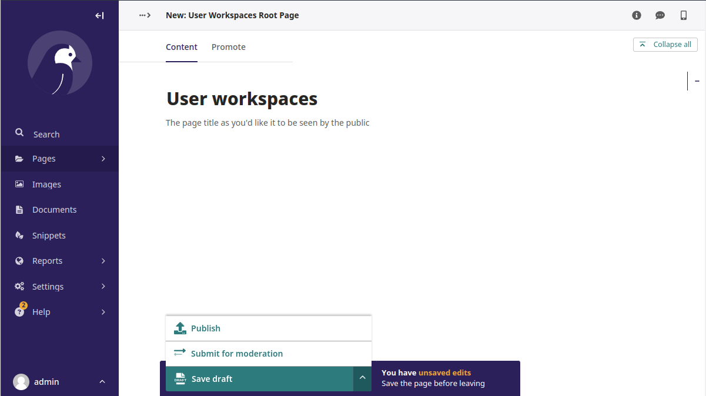
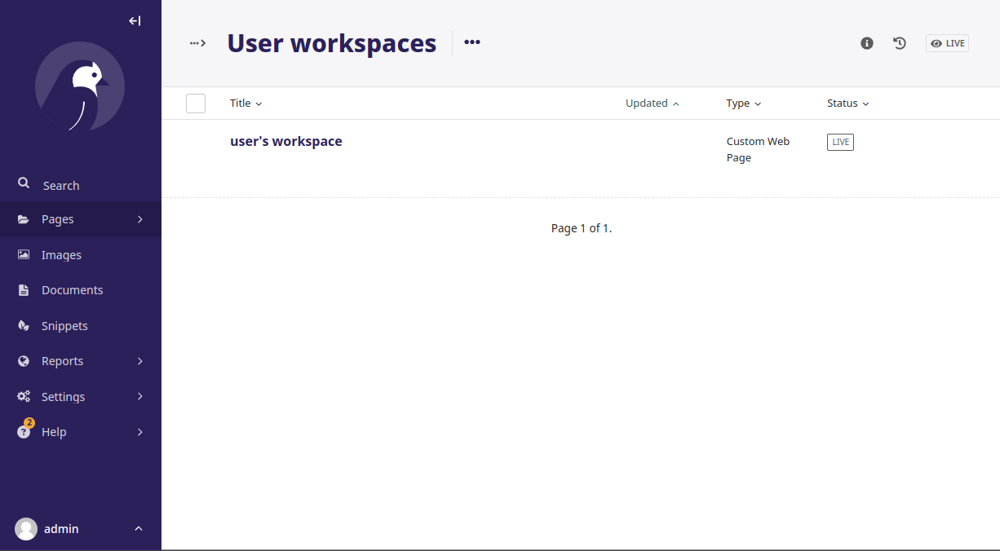

# Wagtail User Workspace

This app creates personal workspace page for every user on registration.

Users are able to publish new child pages under their workspace page. This includes minimal needed permissions to do so. Namely access to Wagtail admin and add, edit and publish permissions to their own workspace page.

Structure and type of these pages is highly customisable.

## Quick start

1. Install "wagtail-user-workspace" using pip
    
    ```
    $ pip install wagtail-user-workspace
    ```

2. Add "wagtail_user_workspace" to your INSTALLED_APPS setting like this:

    ```
    INSTALLED_APPS = [
        ...,
        "wagtail_user_workspace",
    ]
    ```

3. Define model for root page that will contain all of the user workspace pages:

    ```
    from wagtail.models import Page
    from wagtail_user_workspace.models import WorkspacePageBase    

    # This page will be used as a root for each users workspace
    class CustomWebPage(Page):
        ...        

    # This page serves as a root page for all the workspace pages
    # Type of these pages is determined by page model defined in subpage_types
    class UserWorkspacesRootPage(WorkspacePageBase, Page):
        ...
        subpage_types = [
            'your_app.CustomWebPage',
        ]
        ...
    ```

    > **Valid workspaces root page rules:**
    > - Page models that subclass `WorkspacePageBase` also has to subclass `wagtail.models.Page`. Any other model that subclasses `wagtail.models.Page` can do as well.
    > - Subclasses of `WorkspacePageBase` has to have exactly one page model defined in `subpage_types`. This also has to be a subclass of `wagtail.models.Page`.

4. Configure workspace page model:
    ``` 
    USER_WORKSPACE_PAGE_MODEL = "your_app.UserWorkspacesRootPage"
    ```

5. Make and apply database migrations with new changes:

    ```
    $ python manage.py makemigrations
    $ python manage.py migrate
    ```

6. Now start your web, navigate to the Wagtail admin interface and create root page for user workspaces:

    

7. After some user signs in, new workspace page will be generated for him.
User has a full controll over this page. He can edit, publish, and even delete it. If defenition of `CustomWebPage` alows it, he can even add subpages.

    
    

## Development

To develop this app locally you can just clone this repo. Then run local server by running 

```
$ python manage.py runserver
```
or when using VSCode just hit F5 or another Run key. VSCode will use settings from [launch.json](.vscode/launch.json)

Then you can start developing this app!

## Testing

You can run tests like that:
```
$ python manage.py test
```


